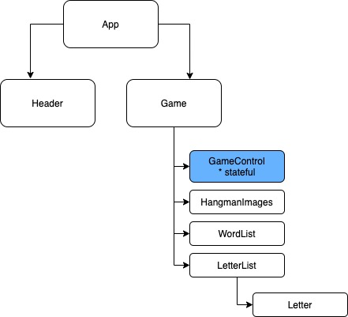

# Hangman

#### By: Michelle Morin, Geoff Goetz, Jeremey Kale Padot April 29-30, 2020

## Description

_This application is a simple hangman game, built using React and Redux. Deployed on [GH Pages](https://michelle-morin.github.io/hangman/)_

## Component Tree / Wireframe

## Specification User Stories
* As a user, I want to be able to guess a letter of a word.
* As a user, I want only letters than I haven't guessed to be shown as options.
* As a user, I want my incorrectly guessed letters to add a new body part to the hangman.
* As a user, I want to be notified if I correctly guess the word.
* As a user, I want to be notified when I lose.
* As a user, I want to be able to restart the game when I win or lose.

## Setup/Installation Requirements

#### Node install

###### For macOS:
_If Homebrew is not installed on your computer already, then install Homebrew by entering the following two commands in Terminal:_
* ``/usr/bin/ruby -e "$(curl -fsSL https://raw.githubusercontent.com/Homebrew/install/master/install)``
* ``echo 'export PATH=/usr/local/bin:$PATH' >> ~/.bash_profile``

_Install Git by entering the following command in Terminal:_
* ``brew install git``

_Next, install Node.js by entering the following command in Terminal:_
* ``brew install node``

###### For Windows:
_Please visit the [Node.js website](https://nodejs.org/en/download/) for installation instructions._

#### Install this application

_Clone this repository via Terminal using the following commands:_
* ``cd desktop``
* ``git clone {url to this repo}``
* ``cd hangman``
_Confirm that you have navigated to the hangman project directory (e.g., by entering ``pwd`` in Terminal)._

_Next, install npm at the project's root directory by entering the following commands in Terminal (macOS) or PowerShell (Windows):_
* ``npm install``
* ``npm start``

_Open the contents of the directory in a text editor or IDE of your choice (e.g., to open the contents of the directory in Visual Studio Code on macOS, enter the command ``code .`` in Terminal)._

## Technologies Used

* Git
* JavaScript
* npm
* Webpack
* React
* Redux
* React-Redux

### License

[MIT](https://choosealicense.com/licenses/mit/)

Copyright &copy; 2020 **_Michelle Morin, Geoff Goetz, Jeremey Kale Padot_** 